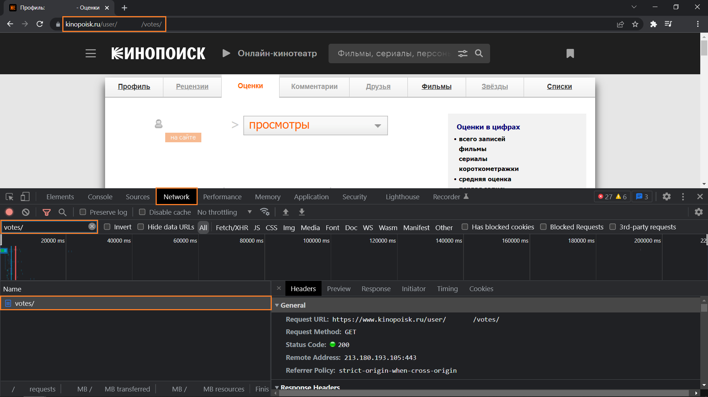
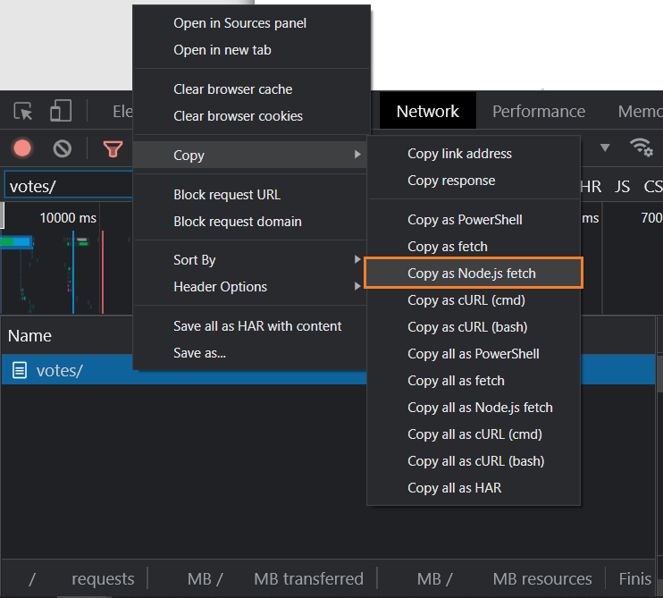
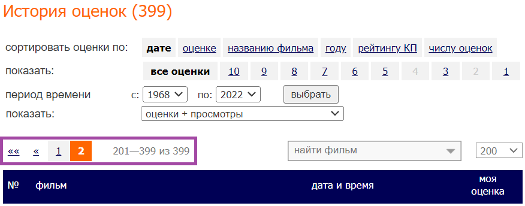

### Description

A few years ago, Kinopoisk removed the ability to export user votes. This repository will help you with that.

---

### Installation

Update the software.
```
sudo apt update && sudo apt upgrade -y
```

Install [`python`](https://www.python.org/) and [`pip`](https://pip.pypa.io/) (python package manager).
```
sudo apt install python3.10 python3-pip
```

Install [`virtualenv`](https://virtualenv.pypa.io/) (python environments manager).
```
pip3 install virtualenv && source ~/.profile
```

Clone this repository and cd into it.
```
git clone https://github.com/mrguseinov-backups/kinopoisk.git && cd kinopoisk
```

Create a new virtual environment and activate it.
```
virtualenv .venv && source .venv/bin/activate
```

Install the required packages.
```
pip install -r requirements.txt
```

Go to the [Kinopoisk](https://www.kinopoisk.ru/) website, sign in and navigate to the votes page, which looks something like:
```
https://www.kinopoisk.ru/user/<user_id>/votes/
```

Press `F12` to open the [DevTools](https://developer.chrome.com/docs/devtools/), switch to the `Network` tab, hit `Ctrl+R` and filter by `votes/`.



Right click the `votes/` request, then `Copy` and `Copy as Node.js fetch`.



Create the `headers.json` file in the project root, paste the copied content into it, and leave only the value from the `headers` key. You should end up with something like the following:

```json
{
    "accept": "...",
    "accept-language": "...",
    "cache-control": "...",
    "sec-ch-ua": "...",
    "sec-ch-ua-mobile": "...",
    "sec-ch-ua-platform": "...",
    "sec-fetch-dest": "...",
    "sec-fetch-mode": "...",
    "sec-fetch-site": "...",
    "sec-fetch-user": "...",
    "upgrade-insecure-requests": "...",
    "cookie": "...",
    "Referer": "...",
    "Referrer-Policy": "..."
}
```

Note that the `headers.json` file must be kept secret!

Find out the total number of pages on the votes page. In the following screenshot, it's `2`.



Set the `num_pages` variable in the `app.py` file.

```python
def main() -> None:
    Downloader().download_vote_pages(num_pages=2)
    Parser().parse_vote_pages()
```

---

### Usage

Activate the virtual environment if it's not active.
```
source .venv/bin/activate
```

Run the `app.py` file.
```
python app.py
```
